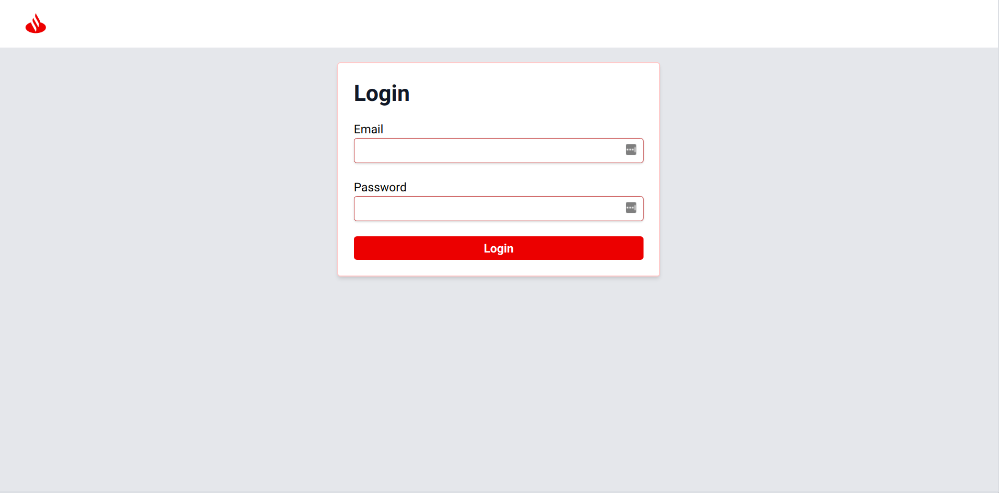
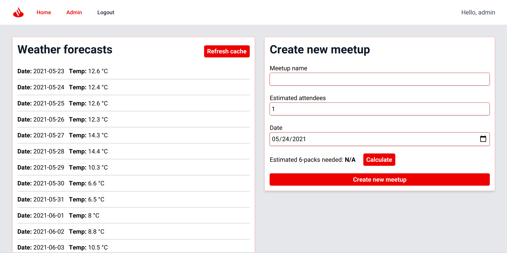
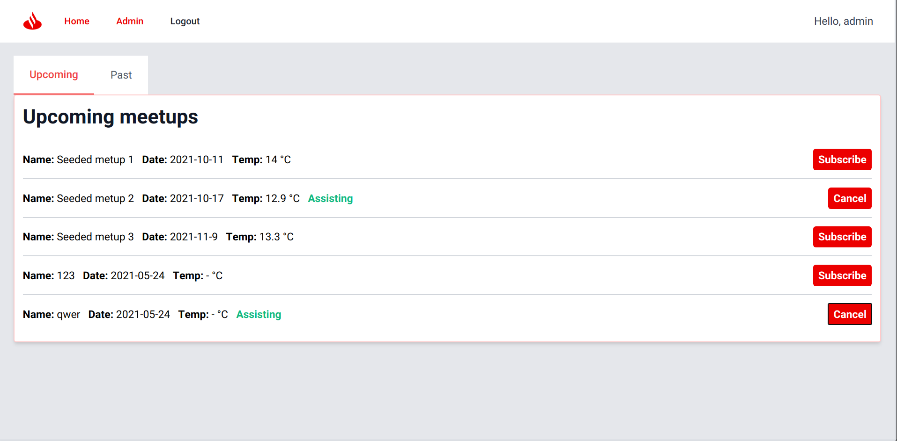
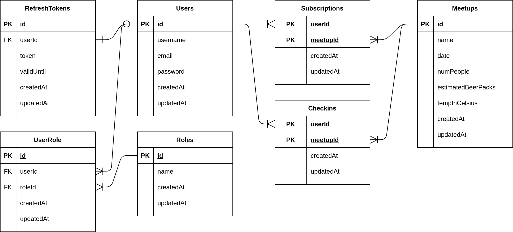
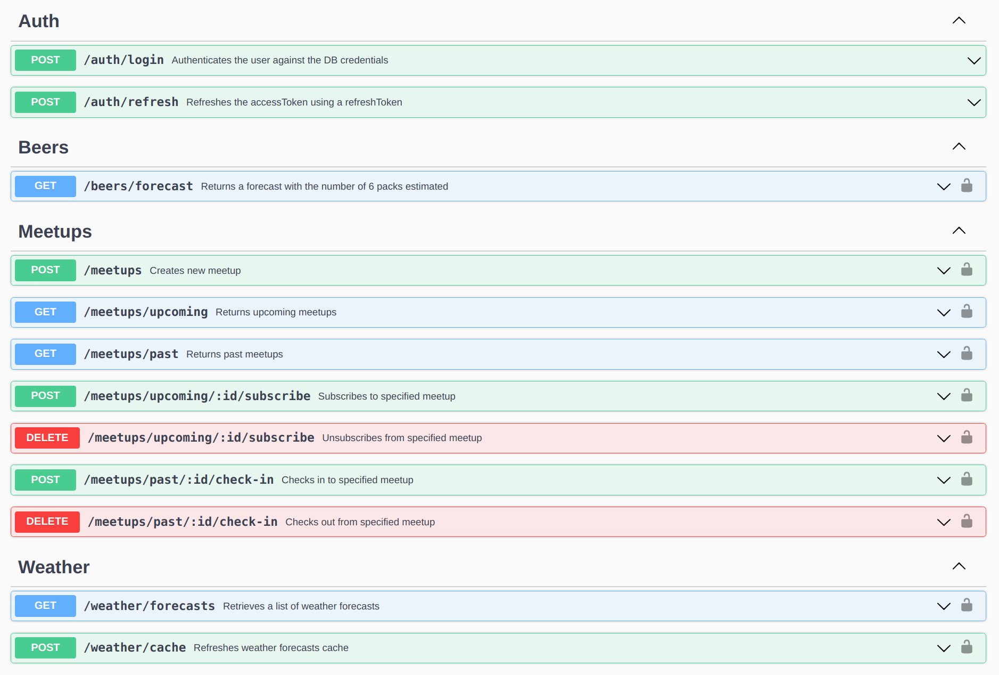

# Meetups Challenge - Santander Tecnología

Este proyecto consiste en una aplicación que permite:
- Como usuario:
  - Visualizar un listado de próximas meetups, con fecha y temperatura en C° estimada
  - Suscribirse/desuscribirse a futuras meetups
  - Hacer check-in/check-out de meetups pasadas

- Como administrador:
  - Todo lo descrito anteriormente para usuarios normales
  - Visualizer un pronóstico de temperatura para los próximos 16 días
  - Crear meetups, especificando nombre, fecha, y cantidad estimada de personas.
  - Obtener, si es posible, una cantidad estimada de cajas de birra necesarias para aprovisionar la meetup.

# Screens de la app

# Detalles técnicos del proyecto

- La app consiste en un frontend web y un server de backend.
- El frontend está desarrollado con React + Typescript, con una UI apta para dispositivos mobiles (responsive).
- El server está hecho con Express + Typescript.
- Para los pronósticos del clima se utilizó la [API de Weatherbit](https://www.weatherbit.io/). Los mismos se cachean en un archivo _.json_ dentro del server mismo. El refresh de este cache se hace de forma manual en el panel de admin.
- La permanencia se logró a través de una base de datos de SQLite, interactuando con la misma a través del ORM [Sequelize](https://sequelize.org/).
- La autenticación y autorización se lograron utilizando JWT (en el backend se implementaron los endpoints y la lógica para usar tokens de acceso y de refresh; por cuestiones de tiempo en el frontend solo se implementó el uso de tokens de acceso)
- La API se autodocumenta utilizando SwaggerUI. Corriendo el server localmente, se puede acceder a los docs en `http://localhost:5000/api/docs`.
- Hay unit tests para la lógica del cálculo de cajas de birra. No se llegaron a implementar 
tests de integration/e2e.

# Instrucciones para correr el backend

Todo esto debe realizarse dentro del directorio `backend/`.

- Copiar el archivo `.env-example`, renombrar la copia a `.env`, y completar con las variables de entorno correspondientes.
  - Tener en cuenta que se necesita una API key para Weatherbit, sino los pronósticos del clima no van a estar disponibles en la app.
- Ejecutar el comando `yarn install` en consola para instalar las dependencias del backend.
- Para correr las migraciones de la base de datos utilizar el comando `npx sequelize db:migrate`.
- Para seedear la db utilizar el comando `npx sequelize db:seed:all`. Es indispensable seedear la db, ya que de esta forma se generan los dos usuarios de la app.
- Ejecutar el comando `yarn start` en consola para correr el proyecto localmente. Por defecto, el server local de backend esta en `http://localhost:5000`.
- Ejecutar `yarn test` para correr los tests unitarios.

# Instrucciones para correr el frontend

Todo esto debe realizarse dentro del directorio `frontend/`.

- Copiar el archivo `.env-example`, renombrar la copia a `.env`, y completar con las variables de entorno.correspondientes. Por ejemplo, para correr el proyecto localmente con los valores por default, utilizar `http://localhost:5000/api` como URL base de la API.
- Ejecutar el comando `yarn install` en consola para instalar las dependencias del frontend.
- Ejecutar el comando `yarn start` en consola para correr el proyecto localmente. Por defecto, el server local de frontend esta en `http://localhost:3000`.

# Utilizando la app

Dado que no hay un CRUD de usuarios implementado, los dos usuarios disponibles se crean al seedear la db. Las credenciales de cada uno son:
- Admin:
  - **email**: admin@admin.com
  - **password**: password
- User:
  - **email**: user@user.com
  - **password**: password

# Más detalles

## DB schema

## API endpoints

## Posibles esquemas de CI/CD

Acá hay muchas opciones... yo haría algo parecido a lo siguiente: tener un pipeline por componente del sistema (en este caso sería uno para front y otro para back). Cada pipeline tiene 3 stages: `testing`, `dev`, y `prod`. 

- `testing` corre los tests unitarios (o que no requieran de varios servicios) y se ejecuta con pushes a cualquier branch del repo. 
- `dev` se ejecuta en merges a la development branch, deploya recursos en el entorno de desarrollo, y corre tests de integración y e2e. 
- Finalmente, `prod` se ejecuta con merges a la main branch, deploya en prod y también corre tests de integration/e2e.

Esto es algo muy general, devops no es mi área de expertise (aunque es interesante).

# Cosas que quedaron pendientes/para mejorar
- El tema notificaciones hubiese sido interesante verlo. La idea para hacer esto era que fuese en tiempo real, teniendo una conexión stateful con el server (con WebSockets), y pusheando notificaciones al cliente de esa forma. Despues se podría haber implementado algo con la [Notifications API](https://developer.mozilla.org/en-US/docs/Web/API/notification) para mostrarlas a nivel browser. Hay servicios tipo [Pusher](https://pusher.com/) que creo hacen cosas similares.
- Habría que implementar la lógica para los refresh tokens en el frontend. How solo hay access tokens y, como se guardan en memoria, al expirar o recargar la página hay que volver a autenticarse (los tokens de acceso se guardan en memoria por cuestiones de seguridad, se podrían haber guardado en local storage, por ejemplo, pero no es lo más seguro)
- Tests! Lo que implementé fueron unos unit tests básicos para la única lógica de negocio de la app (el cálculo de birras), pero faltaron integration y e2e (estuve como 1 hora tratando de correr programáticamente las migraciones en la mock db y desistí). Tests de UI también se podrían agregar, pero no se me ocurrieron casos específicos para esto fuera de smoke tests
genéricos.
- La idea del cache implementado no es que se haga manualmente, sino que haya un cron (o mejor aun, una función serverless) que le pegue al endpoint de refresh una vez por día para actualizar. Para no hacerla demasiada complicada, en la app se implementó la posibilidad de hacerlo manual desde el panel de admin.
- Cosas mencionadas en la consigna que no agregué: i11n, lógica de retries, circuit breaker pattern (esto de hecho nunca lo implementé, vi que para Express hay un [middleware](https://www.npmjs.com/package/express-circuit-breaker) que estaría bueno chusmear).
- Obviamente hay un montón de cosas que faltan relacionadas al funcionamiento básico (registro/creación de usuarios, edición y borrado de meetups, etc.) que no se implementaron porque no eran parte de las user stories, pero en una app real no deberían faltar.